# Install VirtualBox

### Background

**VirtualBox** is a free and open-source virtualization software developed by Oracle that allows you to run multiple operating systems (called "guest OSes") on a single physical machine (the "host OS"). It works by creating virtual machines (VMs), each with its own virtual hardware, such as a CPU, memory, disk, and network interface.  It’s widely used for software testing, running legacy systems, cybersecurity labs, and development environments without needing separate physical machines.

### Ensure virtualization is enabled.

Select Ctr-Shift-Escape. When Task Manager opens, select Performance and CPU. On the bottom you can see if virtualization is enabled.

  

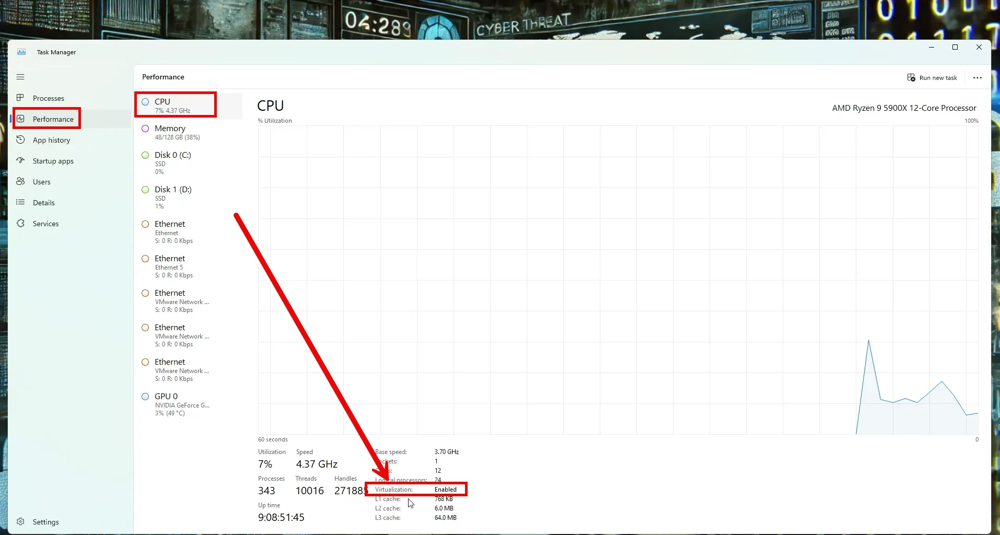

## If not, enable it in the BIOS.

If virtualization  is disabled on your PC, it's fairly easy to turn on, but it does require  going through your BIOS. To get to your BIOS, first off, restart your PC. As your computer's  restarting, you'll need to press the hotkey that brings you into the BIOS, and that depends on the  brand of the computer that you have. Typically, it's the Escape key, or it could be F2, or it could be the Delete key. You'll need to look that up for the maker of your PC. On a Dell it happens to  be F2.

Once the BIOS is open, go to the Advanced tab and toggle down to virtualization. If it is not enabled, then go ahead and enable it. 

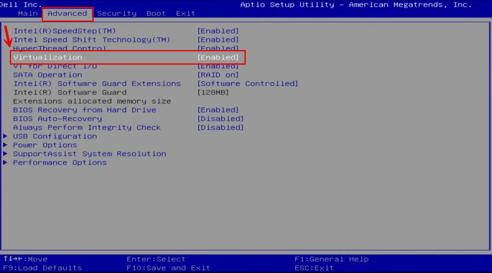

Save and Exit, on a Dell you can enter F10.

### Download VirtualBox

Navigate to [Virtualbox.org](http://Virtualbox.org) and select Download.

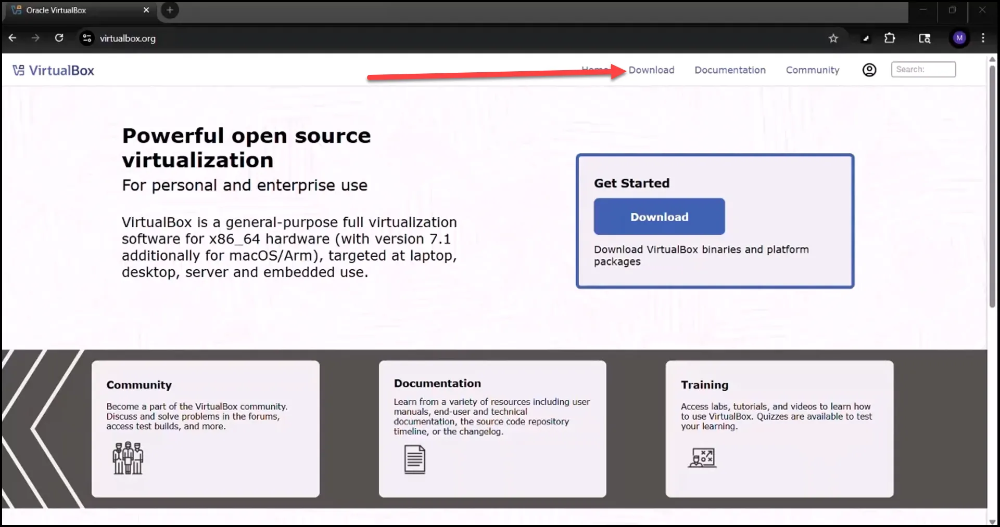

 

Choose the appropriate download, based on your host operating system. In my case it is Windows.

 

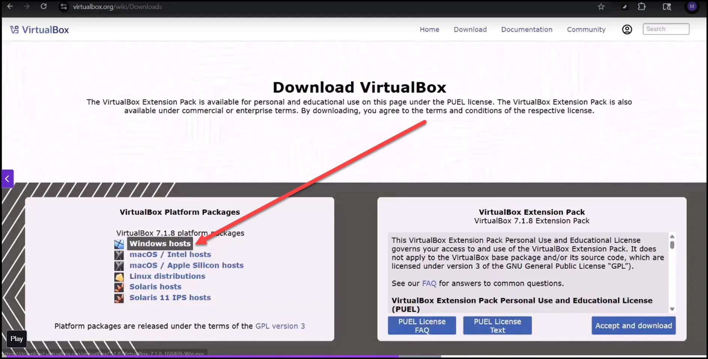

After the download, right click the downloaded file and select “run as administrator” to install VirtualBox. 

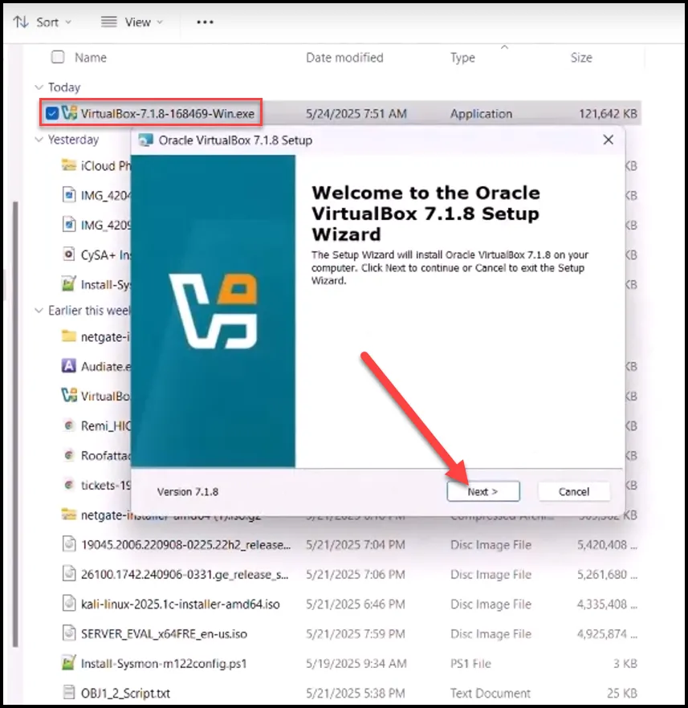

Select all the default features to be installed.

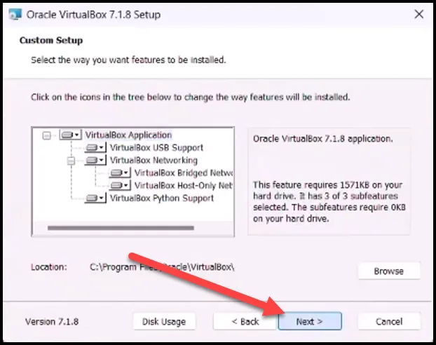

Select Yes to proceed with installation.

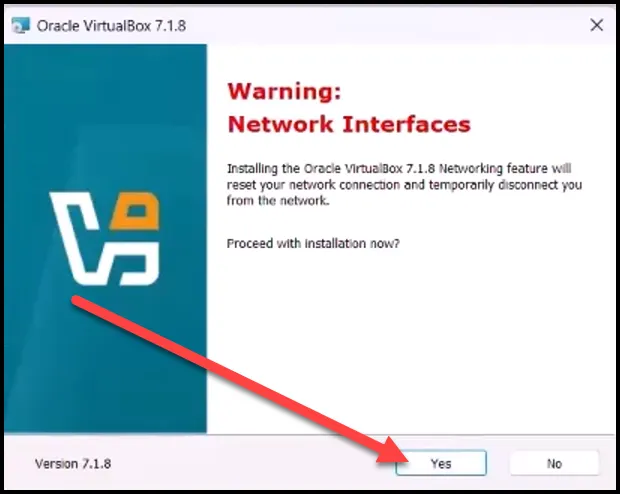

Install any needed dependencies. 

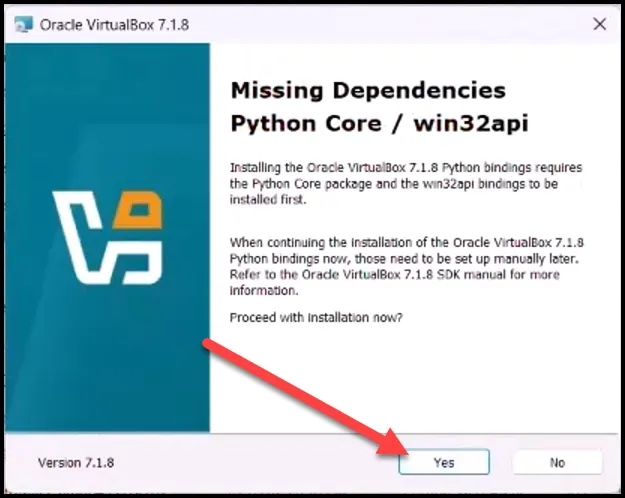

Select Next.

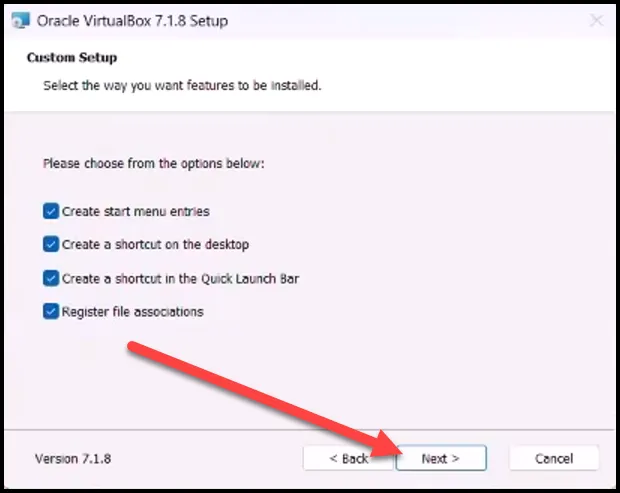

Select Install.

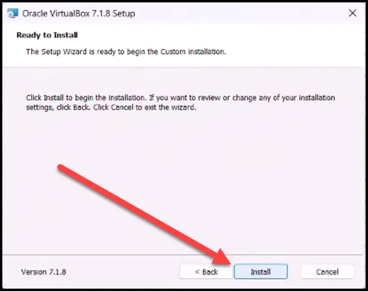

Select Finish.

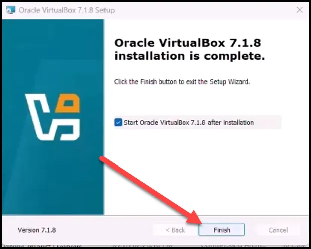

Once completed, you are now ready to install your first VM. We will download and install VMs in future lessons. 

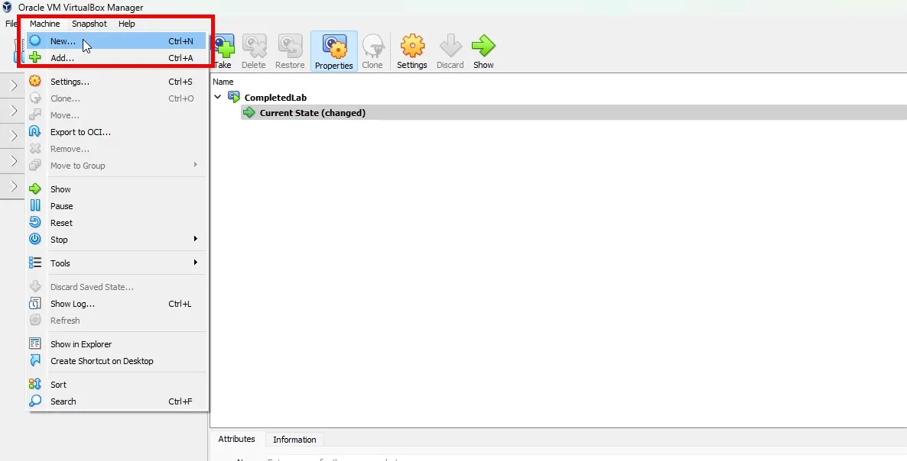