# Install Metasploitable 2

### Summary:

This walkthrough will install Metasploitable 2.  

Below is the network diagram.

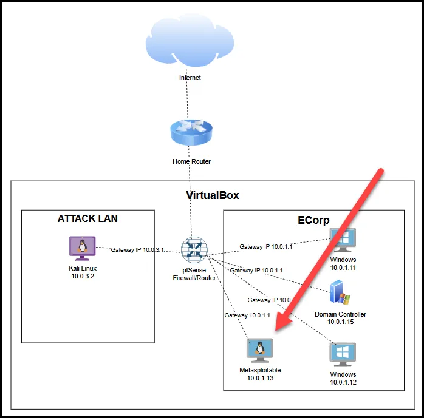

*The exact IP addresses may be different, but should be withen the same subnet.

## Downloads

Download Metasploitable 2 and Windows from the links below.

[Metasploitable 2 | Metasploit Documentation](https://docs.rapid7.com/metasploit/metasploitable-2/)

Select the sourceforge link.

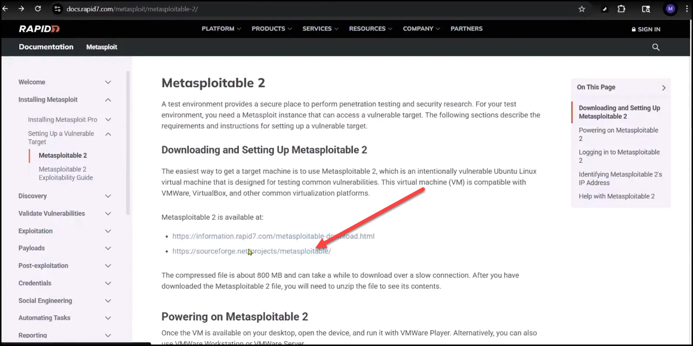

Select Download.

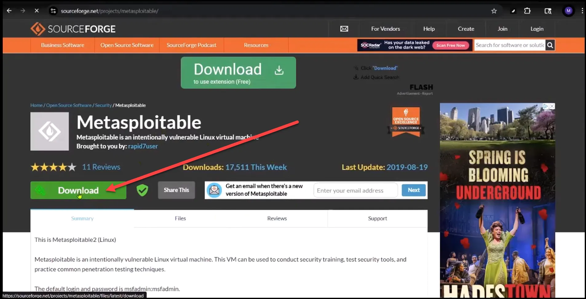

Unzip Metasploitable. I recommend using 7-zip.

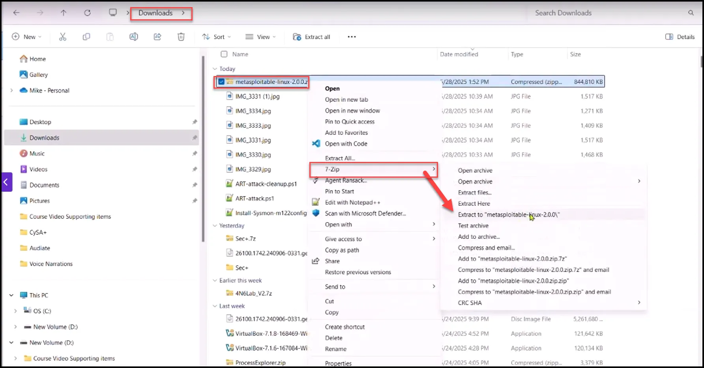

## Install Metasploitable 2

1) Ensure pfSense is running.

2) Select Machine —>New

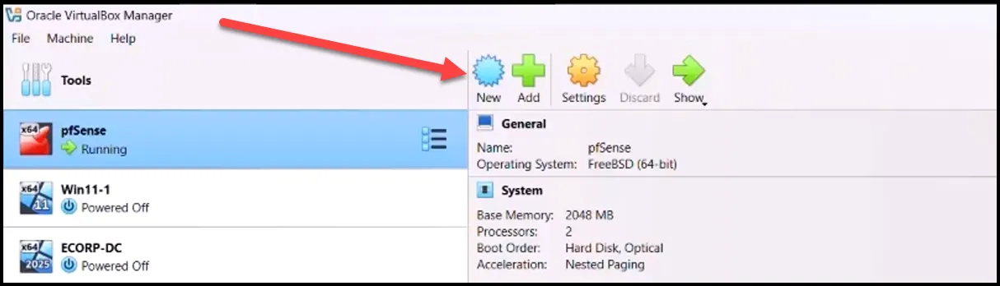

3) Type in the VM name, folder you want to save it in, type=Linux, and Version=Debian(64-bit). Leave the ISO Image as not selected for now. Select Next.

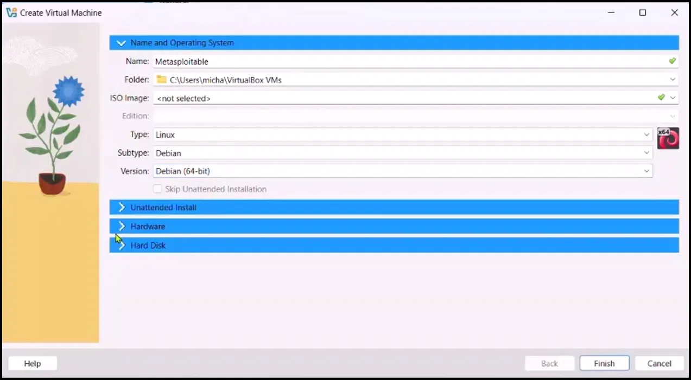

 

1. Go to Hardware and change Base Memory to 2048MB and keep the CPU as 1.

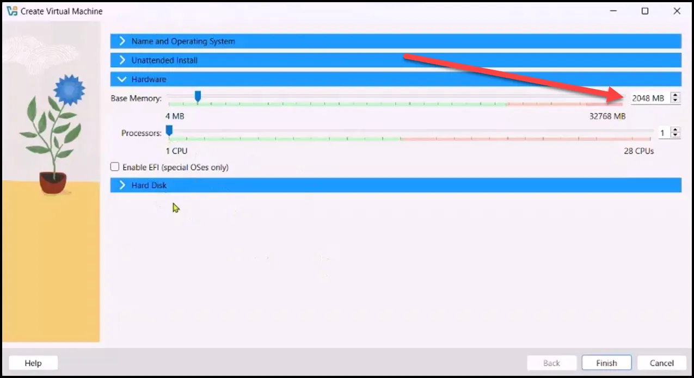

1. Under Hard Disk, select “Do Not Add Virtual Hard Disk” and select Finish.

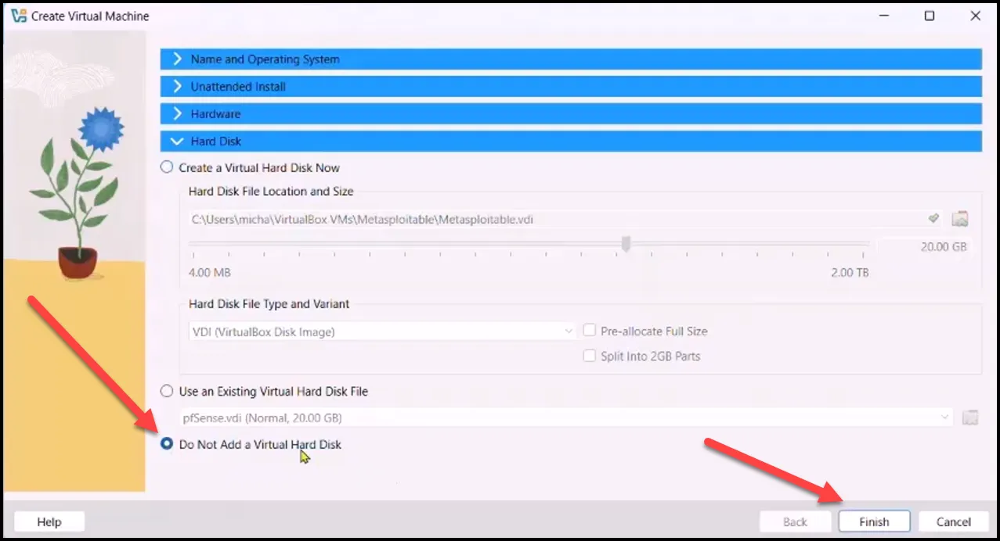

1. Go to Settings and select Storage. Then highlight Controller:SATA and click the icon to add a hard disk.

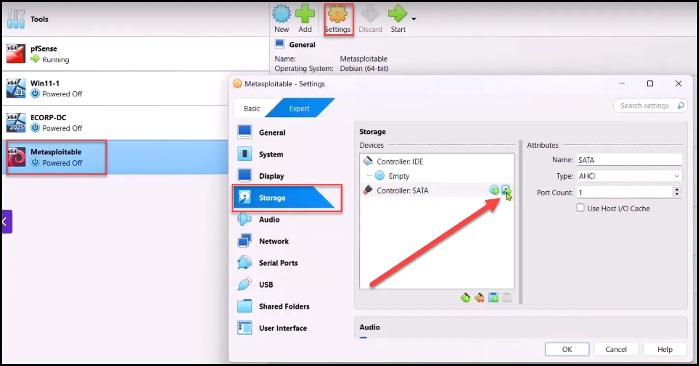

1. Click add and select the .vmdk file where you saved the unzipped folder and select Open.

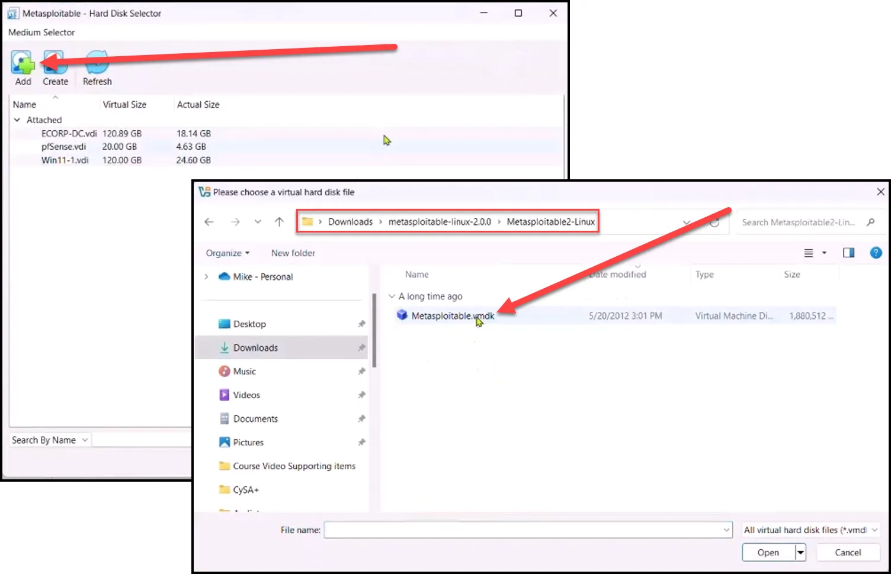

1. Highlight Metaspoitable.vmdk and select Choose.

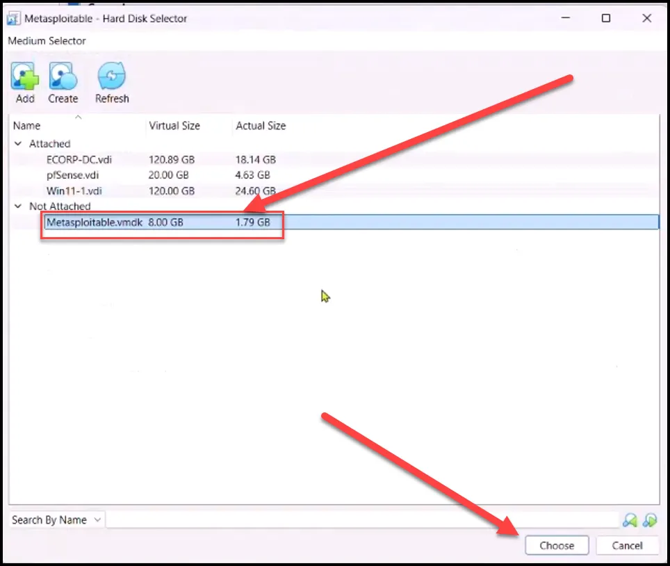

1. You should now see it listed under the controller.

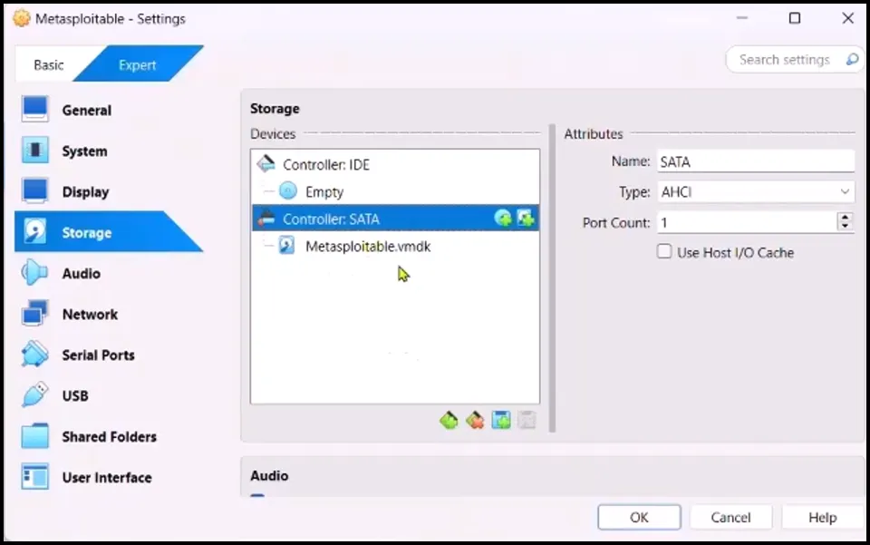

1. Go to Audio tab and deselect audio.

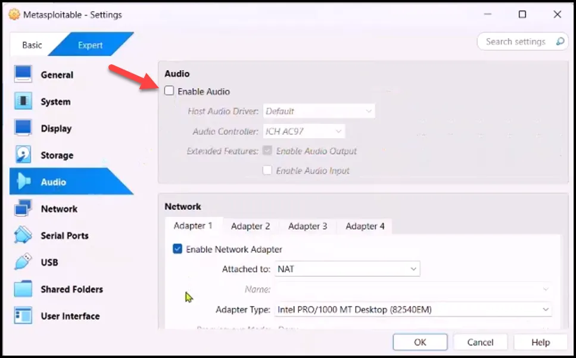

1. Go to Network and select Adapter 1, Internal Network, and change the Name to LAN 1

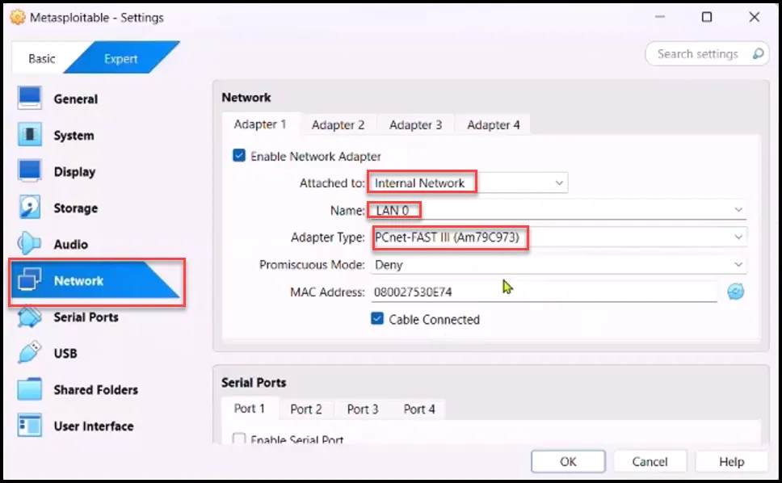

On adaptor type, do not use Paravirtualized Network (virtio-net) adapter for Metasploitable 2. Use  PCnet-FAST III instead. Virtio-net doesn't work with Metasploitable because Metasploitable uses an old kernel with no Built-in VirtIO Driver.  Metasploitable 2 is based on Ubuntu 8.04 (really old). That kernel doesn’t include drivers for virtio-net, so it can’t detect or use the network card at all. No Guest Additions or Modules Preinstalled: Virtio-net often requires modern Linux distributions or manual driver installation, which isn’t feasible or recommended in Metasploitable 2. Virtio is optimized for performance, not compatibility: It's great for modern OSes (e.g., modern Debian, Ubuntu, Fedora, etc.) but not backward-compatible with older systems unless you build support in. 

1. Disable USB.

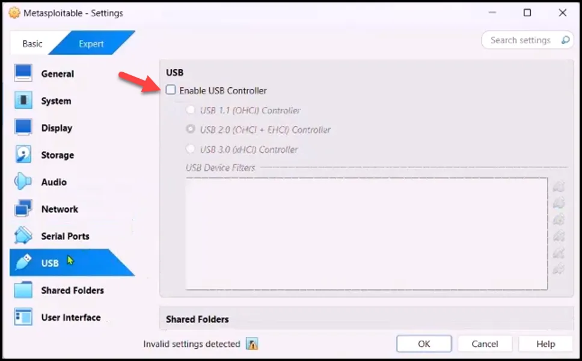

## Testing Our Configuration

Start Metasploitable 2.

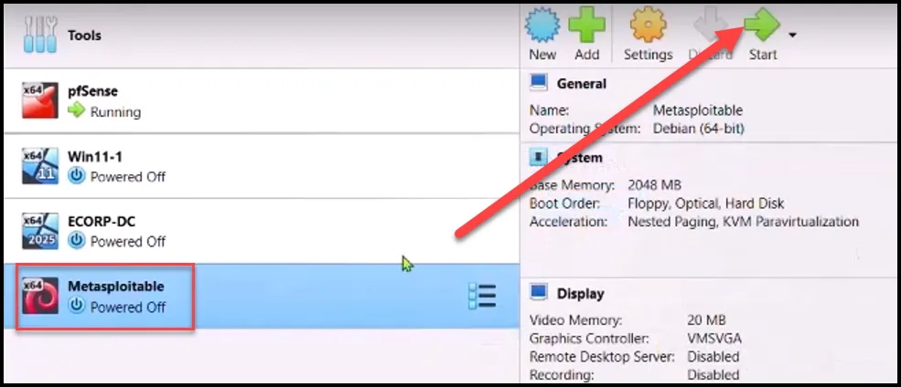

Log in with the creds msfadmin:msfadmin

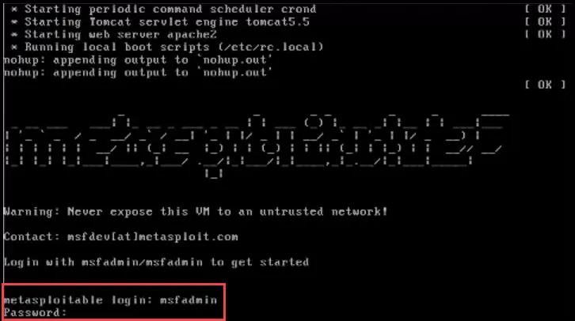

Check the IP address by typing ifconfig

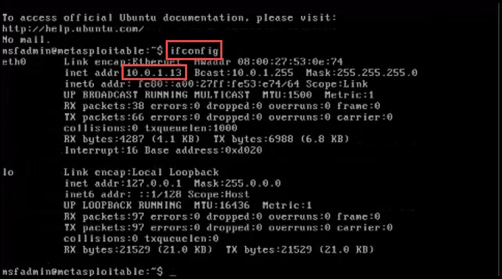

As seen above, we have correctly configured Metasploitable 2 in the Ecorp LAN.
