# Install Sysmon on Windows 11

## Sysmon Review

*System Monitor* (*Sysmon*) is a Windows system service and device driver that, once installed on a system, remains resident across system reboots to monitor and log system activity to the Windows event log. It provides detailed information about process creations, network connections, and changes to file creation time. By collecting the events it generates using [Windows Event Collection](https://msdn.microsoft.com/library/windows/desktop/bb427443(v=vs.85).aspx) or [SIEM](https://en.wikipedia.org/wiki/security_information_and_event_management) agents and subsequently analyzing them, you can identify malicious or anomalous activity and understand how intruders and malware operate on your network. The service runs as a [protected process](https://learn.microsoft.com/en-us/windows/win32/services/protecting-anti-malware-services-#system-protected-process), thus disallowing a wide range of user mode interactions.

*Sysmon* includes the following capabilities:

- Logs process creation with full command line for both current and parent processes.
- Records the hash of process image files using SHA1 (the default), MD5, SHA256 or IMPHASH.
- Multiple hashes can be used at the same time.
- Includes a process GUID in process create events to allow for correlation of events even when Windows reuses process IDs.
- Includes a session GUID in each event to allow correlation of events on same logon session.
- Logs loading of drivers or DLLs with their signatures and hashes.
- Logs opens for raw read access of disks and volumes.
- Optionally logs network connections, including each connection’s source process, IP addresses, port numbers, hostnames and port names.
- Detects changes in file creation time to understand when a file was really created. Modification of file create timestamps is a technique commonly used by malware to cover its tracks.
- Automatically reload configuration if changed in the registry.
- Rule filtering to include or exclude certain events dynamically.
- Generates events from early in the boot process to capture activity made by even sophisticated kernel-mode malware.

## Download Sysmon

[Sysmon - Sysinternals](https://learn.microsoft.com/en-us/sysinternals/downloads/sysmon)

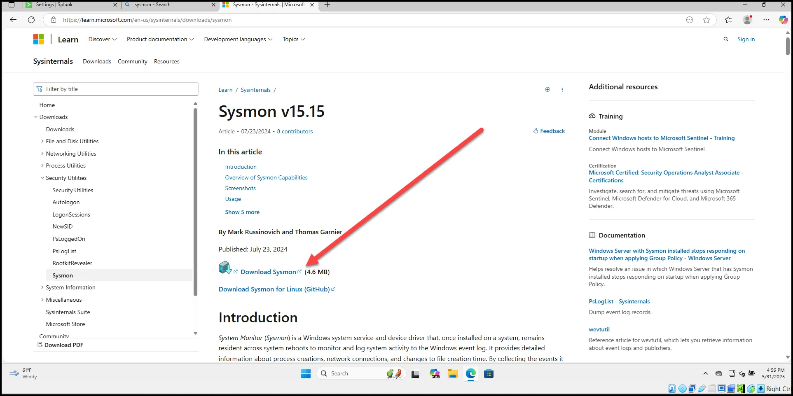

## Download Sysmon Modular configuration file.

Go to this link and scroll down to pre-generated configurations.

https://github.com/olafhartong/sysmon-modular

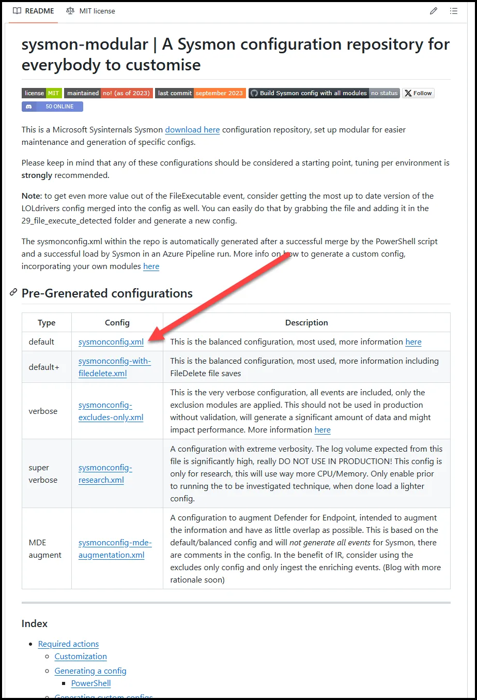

## Install Sysmon

Unzip the Sysmon.zip

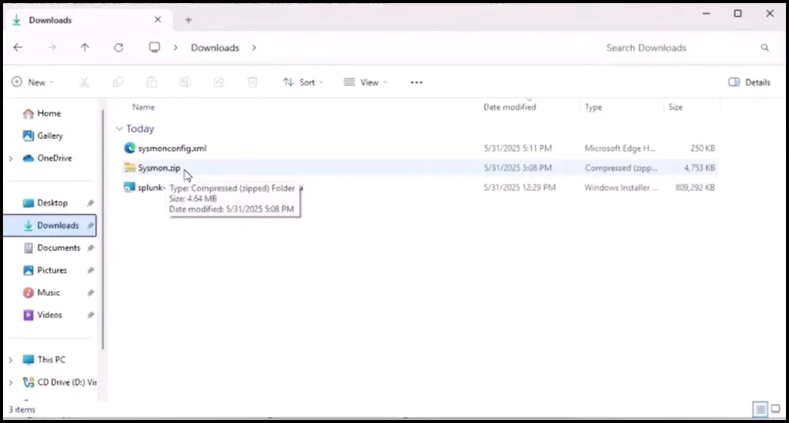

Move the downloaded configuration file and to the unzipped Sysmon folder.

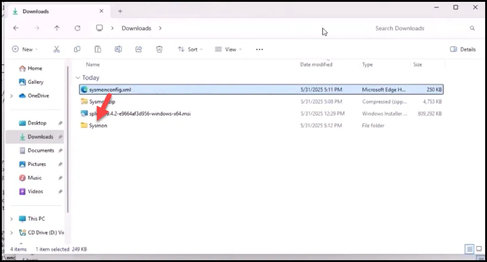

Move the Sysmon folder to C:

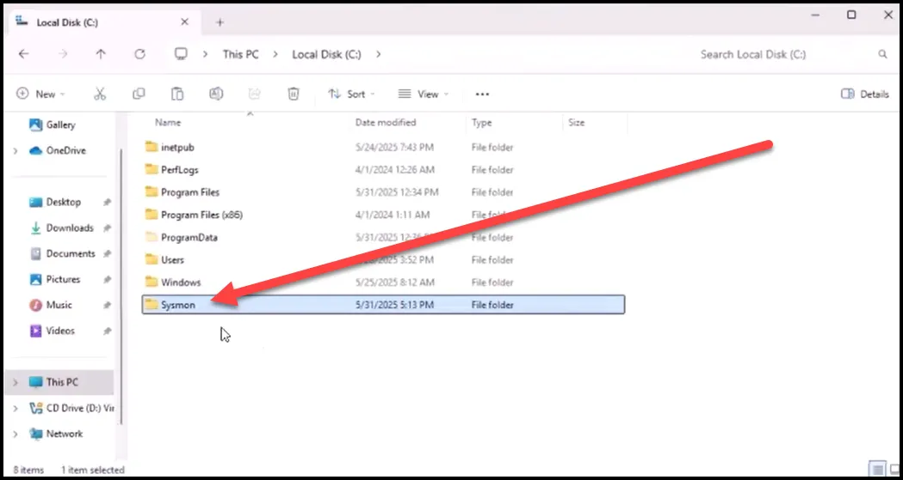

Start the command prompt as administrator and navigate to the Sysmon folder.

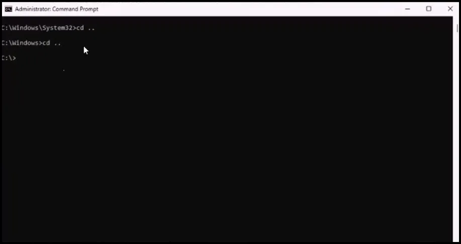

Run the command below to install Sysmon.

```jsx
sysmon -accepteula -i config.xml
```

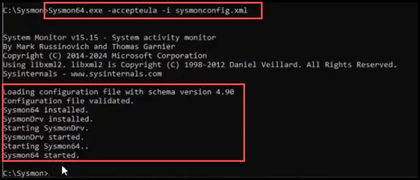

## Test Sysmon Installation

Open Event Viewer as Admin.

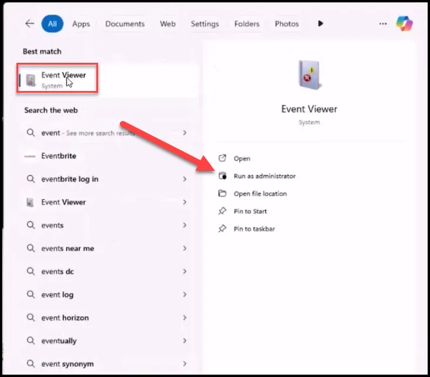

Log in with Domain Admin credentials.

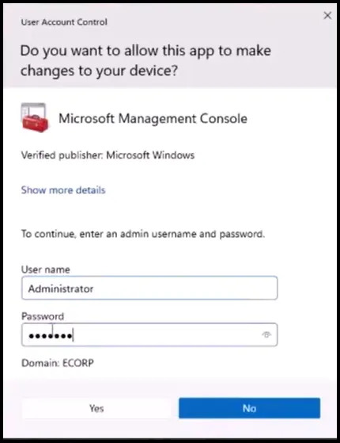

Navigate to Applications and Service Logs → Microsoft →Windows → Sysmon → Operational

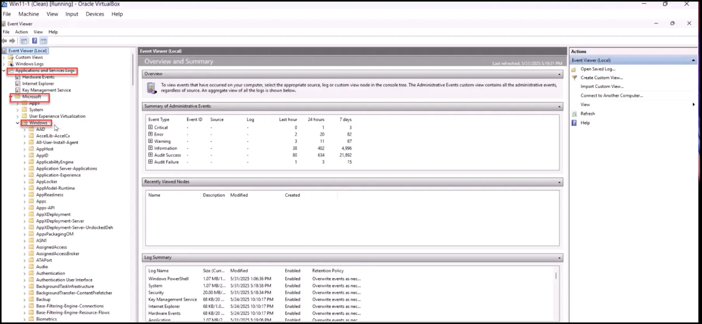

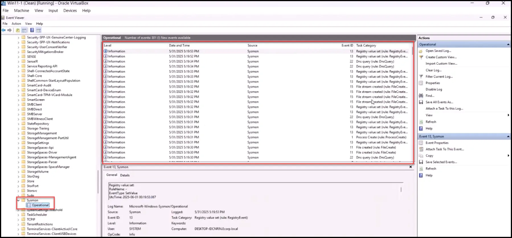

As seen above the installation was successful and Sysmon events are being logged.