# Installing Splunk on Win 11

These instructions are for installing Splunk on a single system.

## Summary

This walkthrough involves installing Splunk on your Windows 11 VM. As previously mentioned, there are data ingestion limitations with the free Splunk instances. To overcome those issues we will install Splunk on the Windows 11 VM only and keep data ingestion disabled until we are ready to run our testing. After we run our testing, we will disable ingestion of logs into Splunk. 

## Install Splunk

Signup for a free Splunk account at this link. You may need a business email (not gmail, yahoo, etc). 

    

[Free Splunk Trial | Download Splunk Enterprise Free for 60 Days | Splunk](https://www.splunk.com/en_us/download/splunk-enterprise.html)

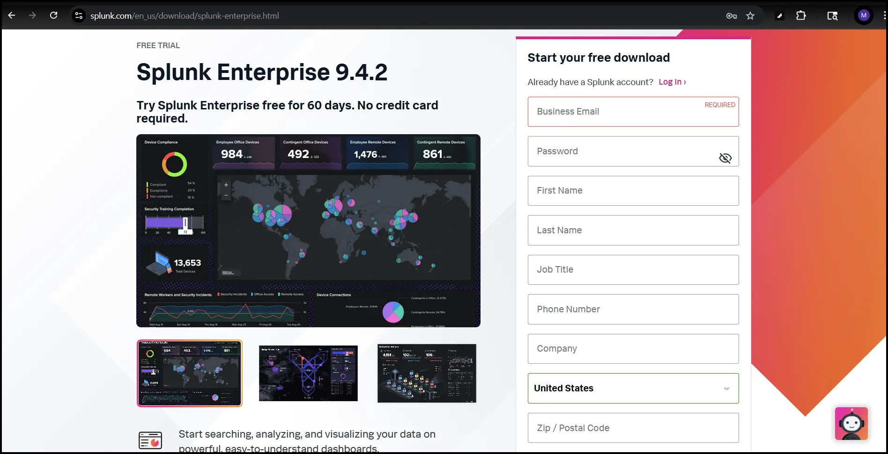

## Set Up Splunk

After you have created an account, from your Windows victim VM login, choose your download by selecting the Windows tab.

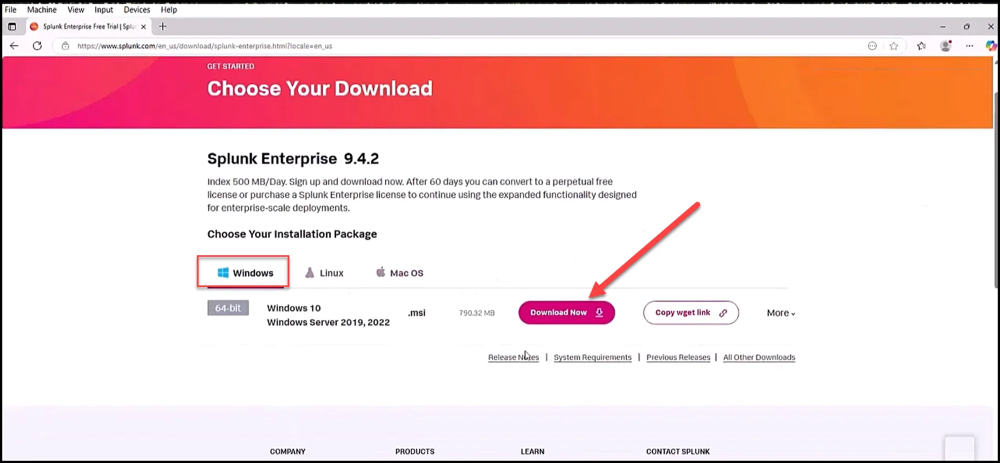

Accept the terms of agreement.

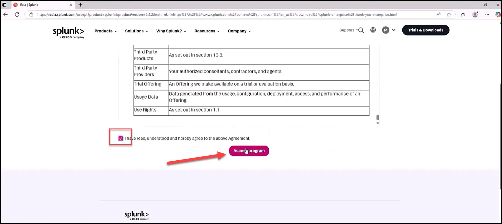

To install Splunk navigate to the directory you downloaded the file and simply double click the .msi file.

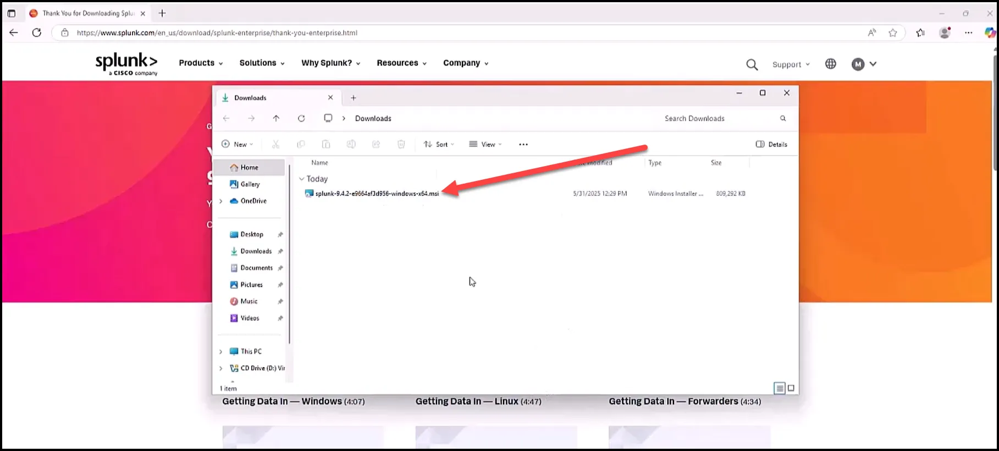

Accept license agreement.

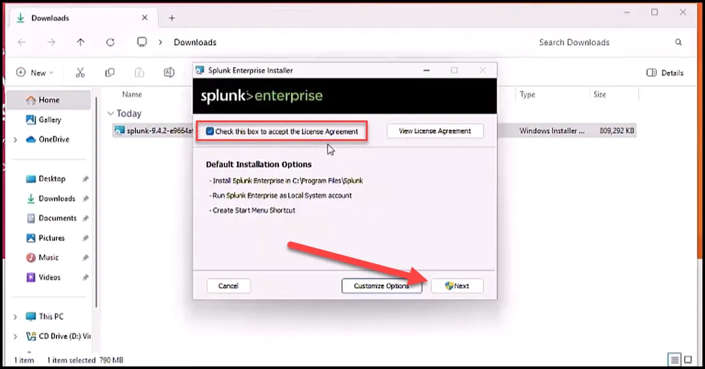

Provide username and password.

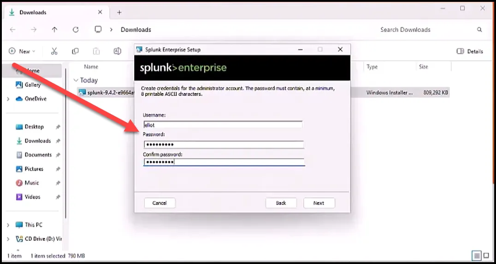

When completed launch Splunk.

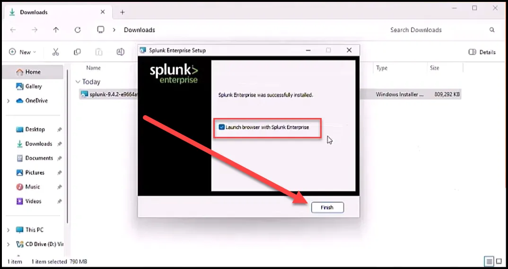

If Splunk does not open up in the browser automatically, type the URL below and login with the credentials you created.

```powershell
localhost:8000
```

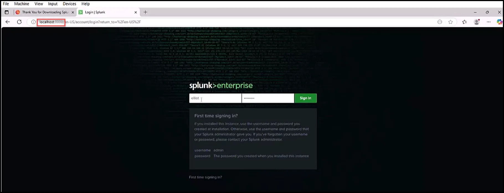

## Add Splunk Apps

Select the Apps dropdown and select “Find More Apps”

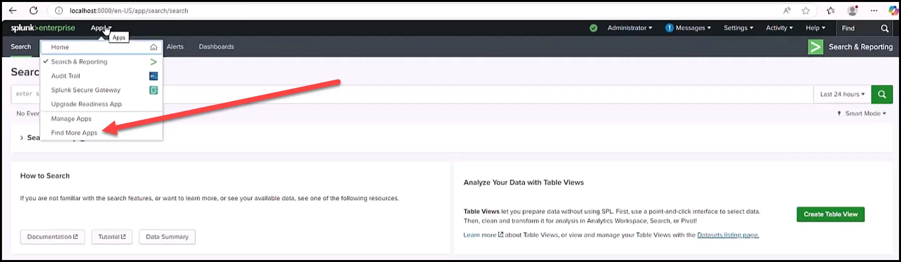

Search for Sysmon and install the Splunk Add-on for Sysmon.

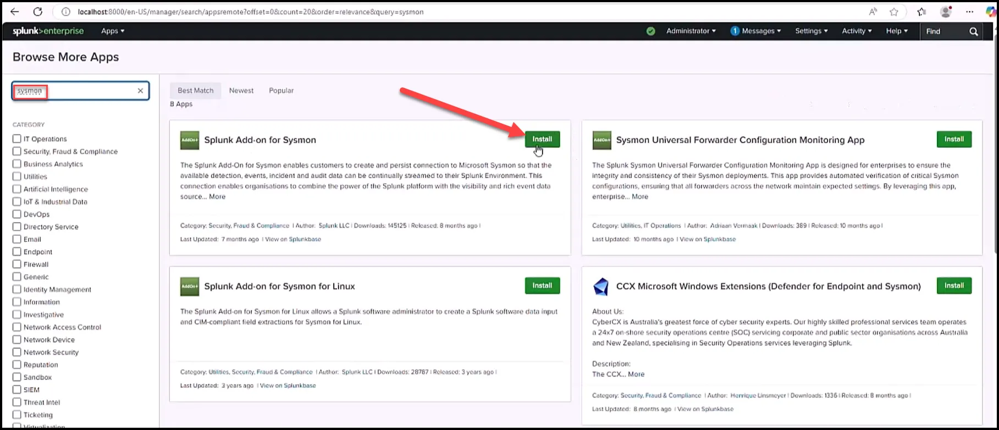

You will be asked to login with the creds for your Splunk account. This is the account you set up when you downloaded Splunk, not the account you set up to access your instance of Splunk.

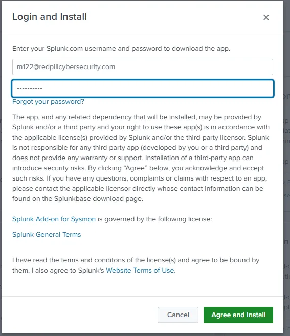

After successfully logging in, the installation will be automatically completed and you will be presented with the box seen below. Select “Done”.

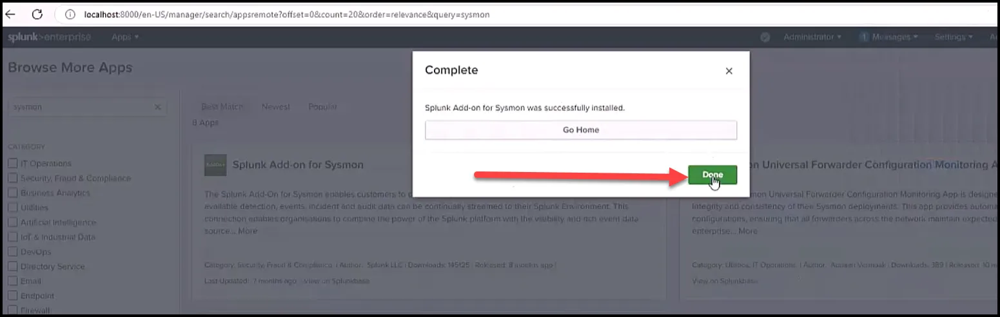

Search and Install the Windows app..

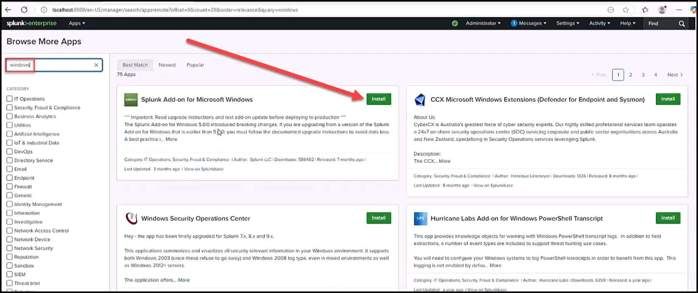

Agree and install.

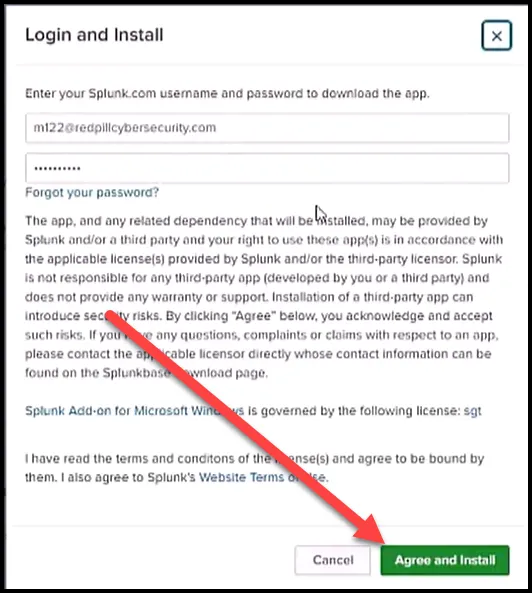

## Set Up Data Inputs

Select the Settings dropdown and the select “Data inputs” from the Data section.

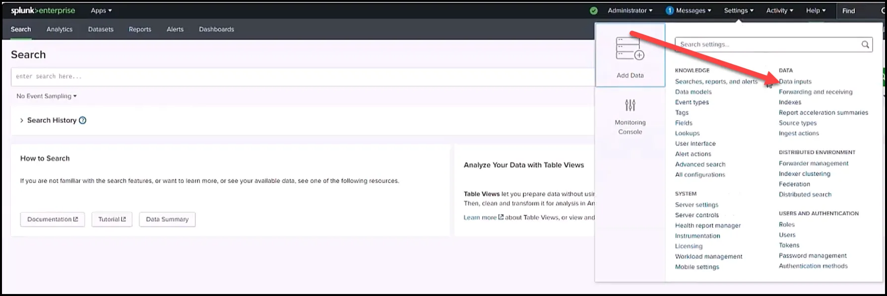

Then select “Remote event log collections”.

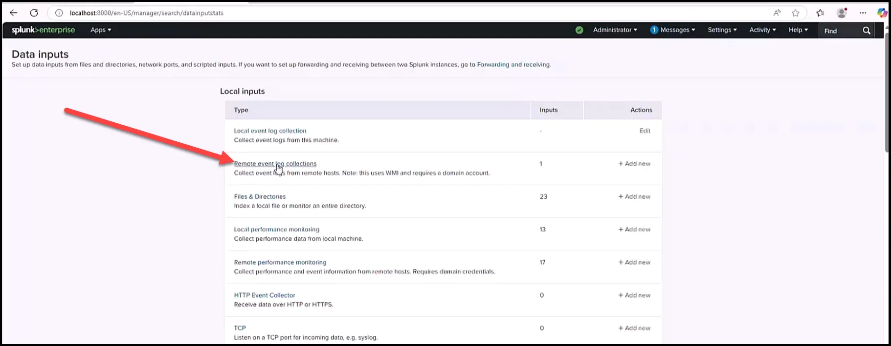

Enable the collection of the logs.

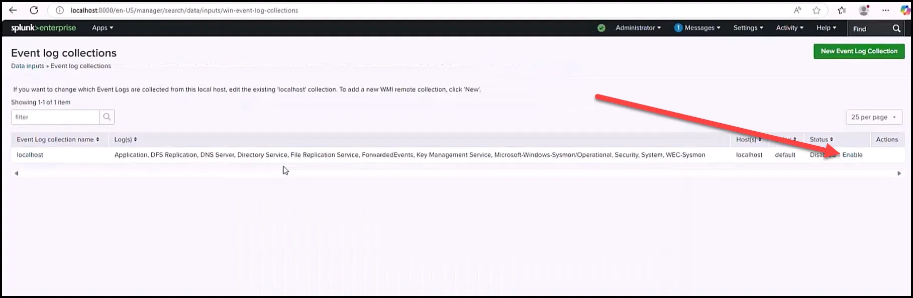

This is also the same way you will disable collection after you run the attack to ensure you do not surpass the data limitations with Splunk. 

Test it by running ipconfig from the command line.

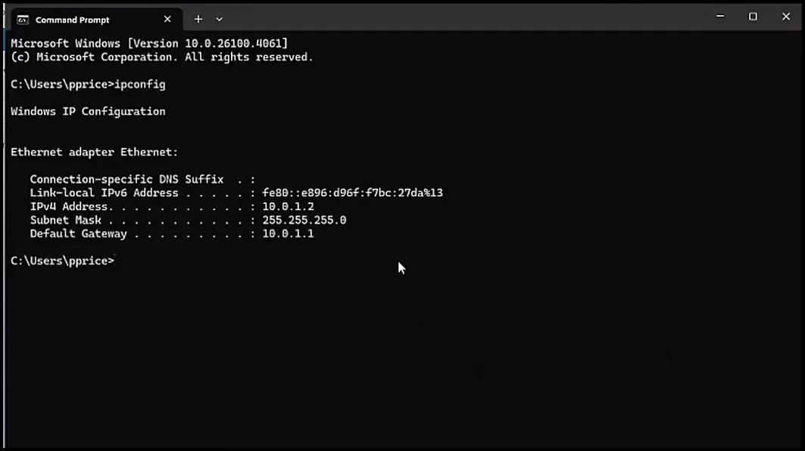

Then go to Splunk Search and Reporting App and look for it. As seen below, one event was discovered.

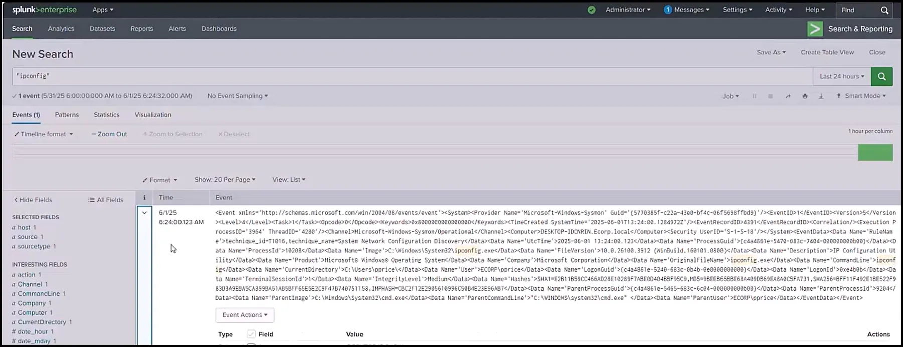