# Snapshots, Snapshots, Snapshots

## Introduction

**Snapshots in VirtualBox** are saved states of a virtual machine (VM) at a specific point in time. When you take a snapshot, VirtualBox records the entire state of the VM—including its disk, memory, and settings—allowing you to return to that exact point later.

### Importance of Taking Snapshots:

- **Testing and Experimentation**: You can try out new software, updates, or system configurations without risk. If something breaks, simply revert to the snapshot.
- **Safe Rollback**: Before making major changes (like installing Guest Additions, changing network settings, or running potentially harmful code), taking a snapshot ensures you can easily undo the changes.
- **Faster Recovery**: Instead of reinstalling or troubleshooting a broken VM, you can quickly restore it to a known good state.

## Network Checks

Ensure all VMs are running.

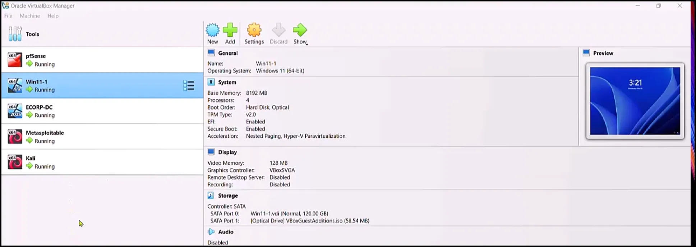

Log in to Kali

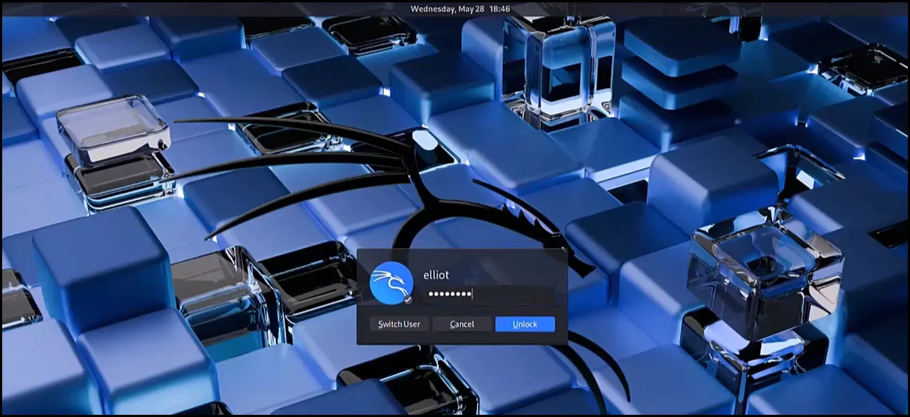

Go to Windows 11 VM and disable the Microsoft Defender Firewall.

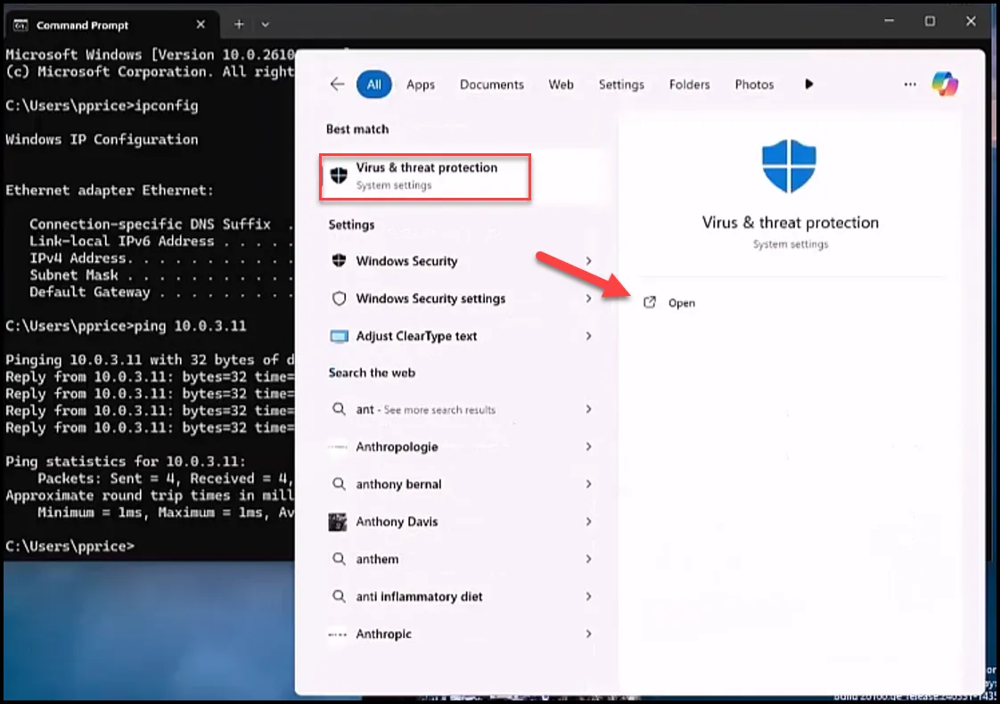

Select Firewall and Network Protection.

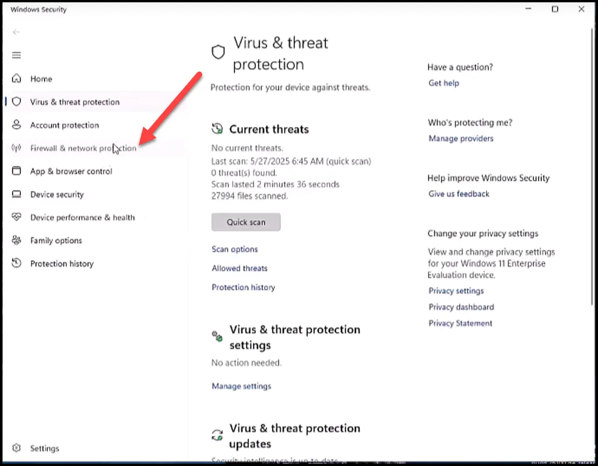

Select Domain network.

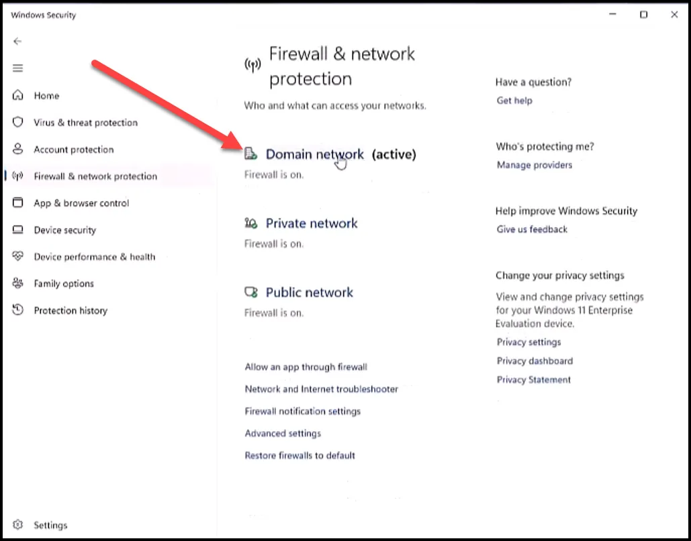

Turn off Microsoft Defender Firewall

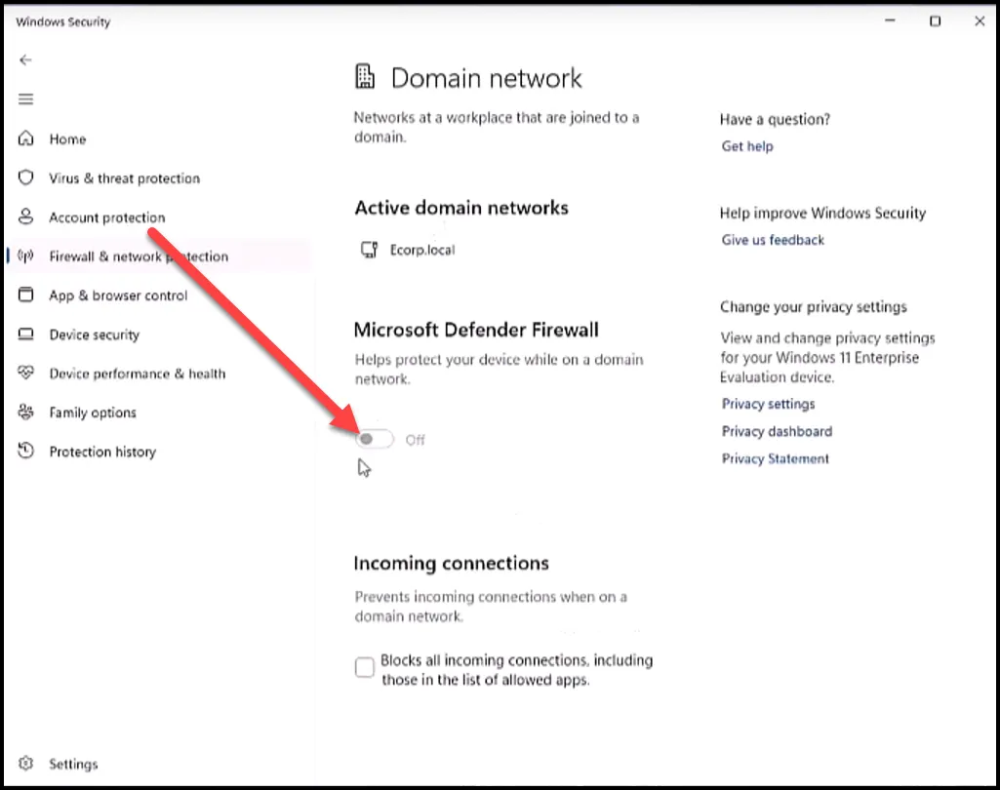

When prompted, log in with the domain Administrator account.

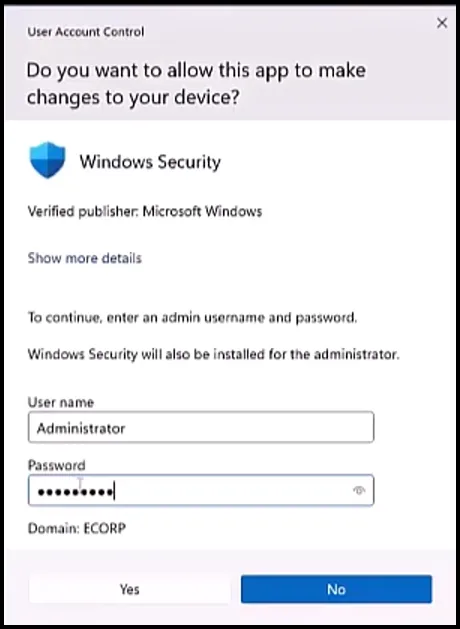

Go back to Linux and ping the Windows 11 VM (10.0.1.2)

As seen below it was successful. Hit ctrl-c to stop the ping.

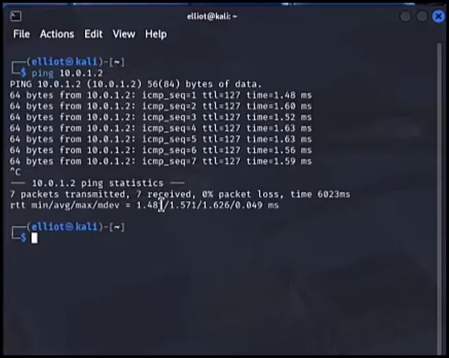

Now ping the Domain Controller (10.0.1.3)

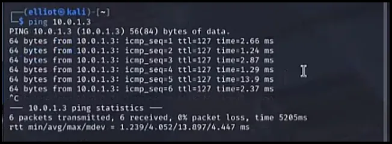

Lastly, ping Metasploitable (10.0.1.13)

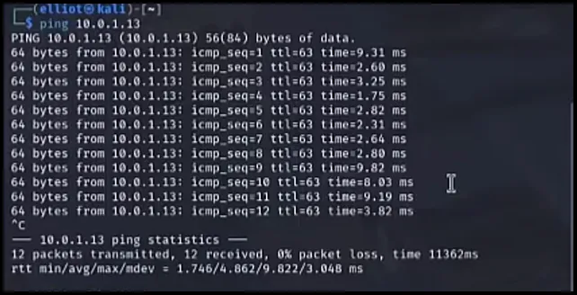

Once again, we were successful. So the Kali VM can ping all the devices in the ECorp subnet.

Now that everything is working correctly, we want to take snapshots of all the VMs so that we can revert back to this state when needed.

## Take Snapshots.

Highlight pfSense and select the hamburger menu. From there select Snapshots.

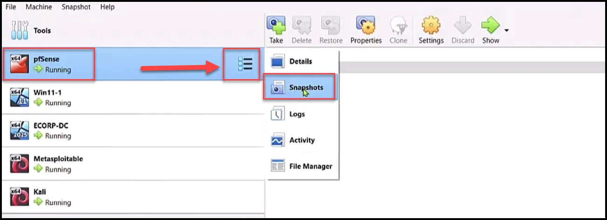

Select the Take button.

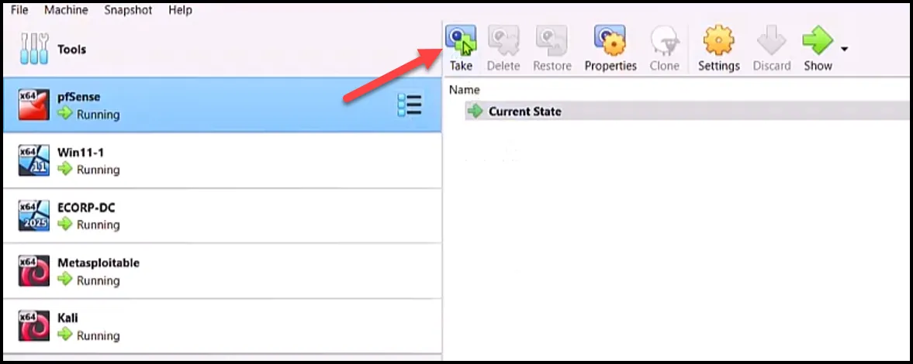

Select a name for the snapshot.

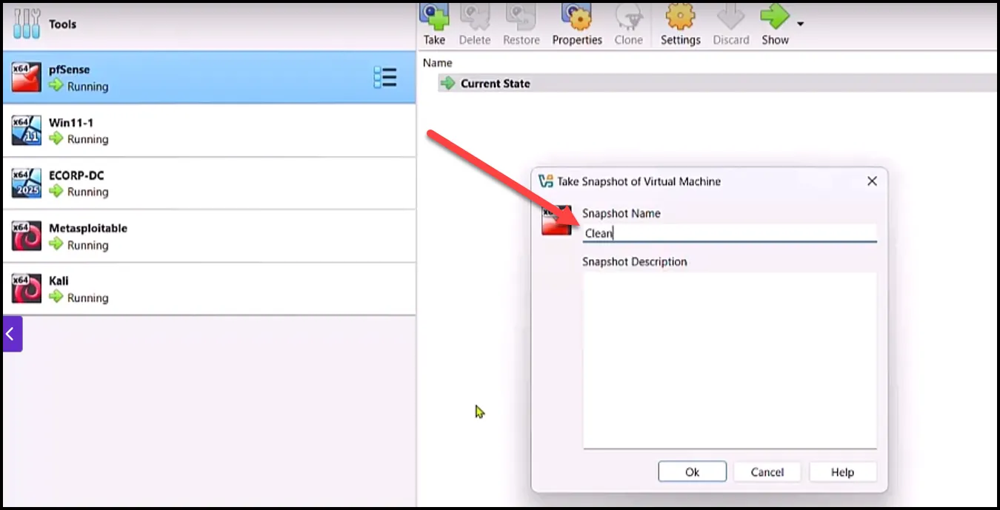

Repeat the same steps for all the VMs.