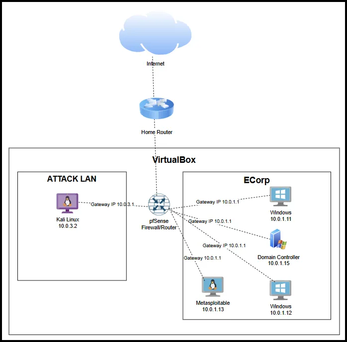

# 🛡️ SOC Lab Setup

This repository contains the complete architecture and configuration files required to build a simulated Security Operations Center (SOC) environment. The lab provides a practical and controlled setting for both offensive and defensive cybersecurity practices, ideal for red vs blue team training, malware analysis, and SIEM detection testing.

---

## 🖼️ Overview

The lab environment is hosted within **VirtualBox** and segmented into two main networks:

- **Attack LAN** – Includes a Kali Linux machine for offensive security operations.
- **ECorp Network** – Simulates an enterprise environment with Windows workstations, a domain controller, and vulnerable hosts, monitored via Splunk.

The environment is protected and routed using **pfSense**, allowing realistic traffic segmentation and firewall configurations.



---

## 📚 Repository Structure

Each phase of the lab setup is documented in separate markdown files for clarity and modularity.


Each document provides step-by-step instructions on installing, configuring, and verifying the components involved in the lab.

| Step | Guide |
|------|-------|
| 1️⃣ | [Installing Virtual Machine Software](./01.%20Installing%20Virtualbox%20on%20Windows.md) |
| 2️⃣ | [Installing pfSense VM](./02.%20Installing%20pfsense.md) |
| 3️⃣ | [Installing Windows 11 VM](./03.%20Installing%20Windows11%20VM.md) |
| 4️⃣ | [Configuring pfSense](./04.%20Configuring%20pfSense.md) |
| 5️⃣ | [Installing Windows Server](./05.%20Installing%20Windows%20Server.md) |
| 6️⃣ | [Installing & Configuring Active Directory](./06.%20Installing%20&%20Configuring%20Active%20Directory.md) |
| 7️⃣ | [Setting Up Users, Groups, and Policies](./07.%20Setting%20Up%20Users,%20Groups%20&%20Policies.md) |
| 8️⃣ | [Domain Joining (Windows 11)](./08.%20Domain%20Joining.md) |
| 9️⃣ | [Installing Metasploitable](./09.%20Installing%20Metasploitable.md) |
| 🔟 | [Installing Kali Linux](./10.%20Installing%20Kali%20Linux.md) |
| 1️⃣1️⃣ | [Installing Sysmon on Windows 11](./11.%20Installing%20Sysmon%20On%20Windows11.md) |
| 1️⃣2️⃣ | [Installing Splunk on Windows 11](./12.%20Installing%20Splunk%20on%20Win11.md) |
| 1️⃣3️⃣ | [Creating Snapshots](./13.%20Snapshots.md) |

---

## 🔧 Key Technologies

- **VirtualBox** – Virtualization platform
- **pfSense** – Network segmentation & firewall
- **Windows 11** – Endpoint simulation
- **Windows Server** – Active Directory & DNS
- **Kali Linux** – Red Team activities
- **Metasploitable 2** – Vulnerable target
- **Splunk** – Log aggregation and analysis
- **Sysmon** – Host-based telemetry for detection

---

## 🎯 Learning Objectives

- Simulate real-world cyber attacks and defensive responses
- Monitor endpoint behavior using Sysmon and Splunk
- Understand Active Directory structure and group policy enforcement
- Practice domain joining, log forwarding, and alert correlation
- Train for Blue, Red, and Purple Team operations

---

## 📝 Usage Notes

- Ensure sufficient hardware resources (RAM, CPU, and disk) to run multiple VMs simultaneously.
- Always snapshot your VMs after each major milestone for quick recovery.
- This lab is for educational purposes **only**. Do not expose it to the internet or use it for unauthorized testing.

---

 ## 📝 Clone this repository:
   ```bash
   git clone https://github.com/CodeLife01/SOC-Analyst-Lab-Setup.git
   cd SOC-Analyst-Lab-Setup
   ```
   
---

## 📜 License

This project is open-source and intended for **educational and non-commercial use only**.

---


## 🙋‍♂️ Author

**Sadeeq Muhammad**  
Cybersecurity Researcher | SOC Engineer  
[GitHub](https://github.com/codelife01)

